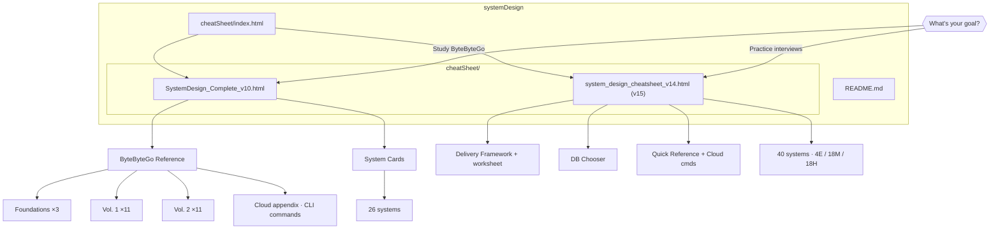

# System Design Cheat Sheets

Offline, self-contained HTML reference guides for system design interview prep. Open any file directly in a browser — no build step or server required.

**Start here:** [`cheatSheet/index.html`](cheatSheet/index.html)

**View on GitHub:** Clicking `.html` in the repo shows **source code**, not a rendered page (GitHub serves HTML as plain text). Use:

| What you want | Open this |
|---------------|-----------|
| **Browse in GitHub now** | [`cheatSheet/github/v15/index.md`](cheatSheet/github/v15/index.md) — 40 systems (Markdown) |
| **HTML in browser (no clone)** | [html-preview](https://html-preview.github.io/?https://github.com/eddyclhung/systemDesign/blob/main/cheatSheet/github/v15-static.html) or see [`cheatSheet/VIEW_ON_GITHUB.md`](cheatSheet/VIEW_ON_GITHUB.md) |
| **Full interactivity** | Enable **GitHub Pages** (Settings → Pages → GitHub Actions) → `https://eddyclhung.github.io/systemDesign/` |

Pre-rendered HTML (`*_github.html`) is for **GitHub Pages** or preview tools — not the repo file click-to-preview.



## Files

| File | Description |
|------|-------------|
| [`cheatSheet/index.html`](cheatSheet/index.html) | Landing page — pick v10 or v15 |
| [`cheatSheet/github/v15/index.md`](cheatSheet/github/v15/index.md) | **v15 on GitHub** — Markdown (renders in repo browser) |
| [`cheatSheet/system_design_cheatsheet_v15_github.html`](cheatSheet/system_design_cheatsheet_v15_github.html) | **v15 HTML** — pre-rendered for Pages / html-preview |
| [`cheatSheet/VIEW_ON_GITHUB.md`](cheatSheet/VIEW_ON_GITHUB.md) | **Viewing guide** — what works where |
| [`cheatSheet/SystemDesign_Complete_v10_github.html`](cheatSheet/SystemDesign_Complete_v10_github.html) | **v10 for GitHub** — pre-rendered system cards |
| [`cheatSheet/github/`](cheatSheet/github/) | Markdown per system |
| [`cheatSheet/SystemDesign_Complete_v10.html`](cheatSheet/SystemDesign_Complete_v10.html) | ByteByteGo Vol. 1 & 2 deep-dive + 26 system cards + cloud appendix |
| [`cheatSheet/system_design_cheatsheet_v14.html`](cheatSheet/system_design_cheatsheet_v14.html) | Staff+ interview prep (v15 content) — 40 systems |
| [`CHANGELOG.md`](CHANGELOG.md) | Version history |
| [`scripts/validate_systems.py`](scripts/validate_systems.py) | Card completeness validator |

## Quick start

```bash
open cheatSheet/index.html
# or directly:
open cheatSheet/system_design_cheatsheet_v14.html
open cheatSheet/SystemDesign_Complete_v10.html
```

Validate card data after edits:

```bash
python3 scripts/validate_systems.py
python3 scripts/build_github_view.py      # regenerate Markdown
python3 scripts/build_prerendered_html.py  # regenerate *_github.html
python3 scripts/build_quick_fire_html.py   # regenerate interview-quick-fire.html
python3 scripts/enrich_quick_fire_ladder.py  # Weak/Strong/Staff+ on quick-fire patterns
```

## Study paths

### Staff answer ladder (daily drill)

Every quick-fire pattern and v15 **Deep dive** uses three rungs. Practice climbing one rung per follow-up — never jump straight to Staff+.

| Rung | Say this | Signals |
|------|----------|---------|
| 🔴 **Weak** | Tool name only | Pattern recall |
| 🟡 **Strong** | Pattern + why it fits this workload | Credible design |
| 🟢 **Staff+** | Failure mode + metric + revisit trigger | Operated production |

**15 min/day:** Pick 3 patterns from [`interview-quick-fire.md`](cheatSheet/interview-quick-fire.md) — say Weak out loud, then Strong, then Staff+ with one metric. **45 min mock:** One v15 card — deliver Strong on architecture, Staff+ on each deep dive when probed.

```bash
python3 scripts/enrich_quick_fire_ladder.py   # after editing patterns
python3 scripts/build_quick_fire_html.py      # colorful HTML
python3 scripts/build_github_view.py          # v15 MD deep dives
```

### 4-week interview prep (v15)

| Week | Focus | Systems |
|------|-------|---------|
| 1 | Easy + framework | Bitly, Dropbox, GoPuff, Google News — memorize delivery framework + estimation worksheet |
| 2 | Medium reads/writes | WhatsApp, News Feed, Yelp, Rate limiter, Notification, Autocomplete — practice 45-min mocks |
| 3 | Hard distributed | Uber, YouTube, Payment, Kafka, KV store, Google Docs — deep dives + failure modes |
| 4 | Gap fill + review | Maps, Email, S3, Wallet + any weak cards — interview mode + print for flashcards |

### ByteByteGo alignment (v10 → v15)

Use v10 chapters for theory, then drill the matching v15 card:

- URL Shortener → Bitly
- Notification System → Notification system (APNs/FCM)
- Google Maps → Google Maps
- Object Storage (S3) → S3 object storage
- Distributed Email → Distributed email (Gmail)
- Payment System → Payment system + Digital wallet

## system_design_cheatsheet_v14.html (v15)

Staff+ prep built around a repeatable delivery framework.

**Delivery framework** — six-step flow plus clarifying questions, latency/QPS numbers, and a live **estimation worksheet**.

**Database chooser** — comparison table (open by default), decision tree, per-DB deep dives, anti-patterns.

**Quick reference** — CAP, protocols, consistency patterns, **cloud services + AWS commands** (full tables in v10).

**Interview quick-fire** — [`cheatSheet/interview-quick-fire.md`](cheatSheet/interview-quick-fire.md) — 50 patterns with **Weak → Strong → Staff+** ladders, DMOP deep-dive spine, and severity callouts. Colorful view: [`interview-quick-fire.html`](cheatSheet/interview-quick-fire.html).

**40 systems** by difficulty:

| Easy (4) | Medium (18) | Hard (18) |
|----------|-------------|-----------|
| Bitly | Ticketmaster | Instagram |
| Dropbox | WhatsApp | YouTube Top K |
| Local delivery (GoPuff) | FB News Feed | Uber |
| News aggregator (Google News) | Tinder | Robinhood |
| | LeetCode | Google Docs |
| | Distributed rate limiter | Distributed cache |
| | FB Live Comments | YouTube |
| | FB Post Search | Web crawler |
| | Yelp | Ad click aggregator |
| | Strava | Job scheduler (Airflow) |
| | Online auction (eBay) | Payment system (Stripe) |
| | Price tracking | Metrics monitoring (Datadog) |
| | Notification system (APNs/FCM) | Message queue (Kafka) |
| | Search autocomplete (Google) | Distributed key-value store |
| | Unique ID generator (Snowflake) | Nearby friends |
| | Hotel reservation (Booking.com) | Google Maps |
| | Gaming leaderboard | Distributed email (Gmail) |
| | S3 object storage | Digital wallet (Apple Pay) |

**UX features**
- Sidebar + topbar search
- Interview mode (5 essential tabs)
- Keyboard shortcuts (`/`, `j`/`k`, `1`–`5`, `Esc`)
- Deep links (`#card-12`, `#uber-ride-sharing`)
- Theme, tabs, studied progress — persisted in `localStorage`
- Prev/Next card navigation
- Copy script button
- Print stylesheet

## SystemDesign_Complete_v10.html

Two-tab cheatsheet: ByteByteGo reference + 26 system cards.

**Quick Reference appendix** — database selection, CAP, protocols, **AWS/GCP/Azure** with CLI commands and Java single-server equivalents.

**Features:** topic search, chapter sidebar, print layout. Links to v15 Staff+ prep in header.

## Which one to use?

- **Studying ByteByteGo** or need cloud CLI reference → `SystemDesign_Complete_v10.html`
- **Practicing live interviews** with framework, DB chooser, scripts → `system_design_cheatsheet_v14.html` (v15)

Both files are standalone — styles and scripts embedded inline. Optional: extract system data with `python3 scripts/extract_systems.py`.
