# Interview quick-fire — problem → staff-level answer

When the interviewer pivots mid-design: *"How would you handle X?"* — answer with **pattern → trade-off → anchor**, then stop unless they want depth.

Full cheatsheet: [system_design_cheatsheet_v14.html](system_design_cheatsheet_v14.html) · [40 system cards](github/v15/index.md) · [Colorful view](interview-quick-fire.html) · [Diagrams](interview-quick-fire-diagrams.html)


## Staff answer ladder

Interviewers score you by depth. For every pattern, practice three rungs:

| Rung | What to say | What it signals |
|------|-------------|-----------------|
| 🔴 **Weak** | Name a tool, skip trade-offs | Junior — pattern recall only |
| 🟡 **Strong** | Pattern + why it fits this workload | Mid — credible design |
| 🟢 **Staff+** | Failure mode + metric + when you'd revisit | Staff — operated production |

Each pattern below includes all three. **Default answer in interview:** Strong in 30s → offer Staff+ if they probe.


## Severity legend

| Badge | Level | When interviewers probe here |
|-------|-------|------------------------------|
| 🔴 **Critical** | Outage / cascade / data loss | Failure modes, "what if X dies?", metastable |
| 🟠 **High** | Resilience under stress | Availability, security, flash-sale contention |
| 🟣 **Important** | Correctness & invariants | Consistency tiers, money, inventory |
| 🟢 **Pattern** | Standard staff answer | Reads, writes, fan-out, storage flows |
| 🔵 **Prep** | Framework & drill | Answer template, DMOP, practice |

> [!NOTE]
> **Colorful view:** open [interview-quick-fire.html](interview-quick-fire.html) for Notion-style callouts, filters, and severity sidebar.


## Navigation

- [Colorful HTML view](interview-quick-fire.html) — Notion-style severity callouts

**Prep & framework**

- [Answer template](#answer-template-use-every-time)
- [How to go deeper — interview prep](#how-to-go-deeper--interview-prep)
  - [Depth ladder](#the-depth-ladder-interviewers-score-this) · [DMOP spine](#dmop--your-deep-dive-spine-24-min) · [Eight follow-up types](#eight-follow-up-types--what-to-say)
  - [If they push (cheat sheet)](#if-they-push--classic-failure-modes-cheat-sheet) · [Worked example: thundering herd](#worked-example--3-minute-deep-dive-on-thundering-herd)
  - [Back-of-envelope numbers](#numbers-to-have-ready-back-of-envelope) · [Prep checklist](#deep-dive-prep-checklist-before-mock)

**Classic failure modes** *(start here for deep dives)*

- [Thundering herd](#thundering-herd) · [Cache stampede](#cache-stampede-dogpile) · [Retry storm](#retry-storm) · [Metastable failure](#metastable-failure)
- [Hot partition / hot key](#hot-partition--hot-key) · [Split brain](#split-brain) · [Poison message](#poison-message) · [Head-of-line blocking](#head-of-line-blocking)
- [N+1 queries](#n1-queries) · [Connection pool exhaustion](#connection-pool-exhaustion) · [Replica lag](#replica-lag--stale-read) · [Slow node (straggler)](#slow-node-straggler)
- [Dual-write problem](#dual-write-problem) · [Circular dependency](#circular-dependency--retry-loop)

**Patterns by topic**

| | | |
|---|---|---|
| [Reads & caching](#reads--caching) | [Writes & throughput](#writes--throughput) | [Availability & resilience](#availability--resilience) |
| [Consistency & correctness](#consistency--correctness) | [Fan-out & real-time](#fan-out--real-time) | [Storage & media](#storage--media) |
| [Messaging & async](#messaging--async) | [Security & abuse](#security--abuse) | [Observability & ops](#observability--ops) |
| [Geo & search](#geo--search) | [Money & transactions](#money--transactions) | [Quick decision shortcuts](#quick-decision-shortcuts) |

**Visual archetypes** *(17 diagrams → 70+ patterns)*

- [**Interactive diagrams (HTML)**](interview-quick-fire-diagrams.html) — zoom, fullscreen, before/after tabs, **fully offline**
- [When to diagram](#visual-archetypes) · [Pattern → diagram map](#pattern--diagram-map)
- Failure modes: [herd](interview-quick-fire-diagrams.html#thundering-herd) · [retry storm](interview-quick-fire-diagrams.html#retry-storm) · [hot key](interview-quick-fire-diagrams.html#hot-key) · [split brain](interview-quick-fire-diagrams.html#split-brain) · [poison msg](interview-quick-fire-diagrams.html#poison-message) · [dual-write](interview-quick-fire-diagrams.html#dual-write)
- Core flows: [cache-aside](interview-quick-fire-diagrams.html#cache-aside) · [fan-out](interview-quick-fire-diagrams.html#fan-out) · [saga](interview-quick-fire-diagrams.html#saga) · [idempotency](interview-quick-fire-diagrams.html#idempotency) · [seat hold](interview-quick-fire-diagrams.html#seat-hold)

**Practice**

- [Practice drill](#practice-drill) — Level 1 quick-fire · Level 2 deep dive · Level 3 interruption

---

## Answer template (use every time)

1. **Pattern** — name the technique in one sentence  
2. **Trade-off** — what you give up; when you'd revisit  
3. **Anchor** — real system, metric, or failure story  
4. **Stop** — invite a deep dive: *"Happy to walk through failure modes."* → see [How to go deeper](#how-to-go-deeper--interview-prep)

---

## How to go deeper — interview prep

> [!NOTE]
> **🔵 Prep** — Interview framework — how to answer and go deeper


When you say *"happy to go deeper"*, the interviewer usually wants **one** of these — recognize which and switch mode:

| Signal | What they want | Your move |
|--------|----------------|-----------|
| *"Walk me through failure modes"* | Ops maturity | Pick **one** failure → detect → mitigate → metric |
| *"What if Redis/DB dies?"* | Resilience | Degraded mode + data loss boundary + recovery |
| *"How does that actually work?"* | Implementation | Step-by-step request path, 3–5 components |
| *"What are the trade-offs?"* | Staff judgment | Name 2 options you rejected and **when you'd flip** |
| *"Scale this 10×"* | Bottleneck hunt | Find current limit → fix → new bottleneck |
| *"How do you know it works?"* | Observability | 3 metrics + 1 alert + 1 runbook action |

**Time budget:** quick-fire = **30s**. Deep dive = **2–4 min** monologue, then Q&A. Don't re-pitch the whole system.

---

### 🔵 The depth ladder (interviewers score this)

Move one rung per follow-up. Never skip straight to Staff+ unless they ask.

```
WEAK     → name a tool ("use Redis")
STRONG   → name a pattern + why it fits this workload
STAFF+   → failure mode + metric + when you'd revisit the decision
```

**Example — thundering herd:**

- **Weak:** "Add caching."
- **Strong:** "Single-flight on cache miss so only one request repopulates the key; TTL jitter so keys don't expire together."
- **Staff+:** "On Redis restart we'd see 100% miss rate — I'd alert on `cache_miss_rate` spike and `db_conn_waiting`. Mitigation: warm top 10K keys before traffic shift, local LRU for hottest keys, circuit breaker to DB if pool >80% saturated. I'd accept per-node staleness on local cache; revisit if we need inventory-grade freshness."

---

### 🔵 DMOP — your deep-dive spine (2–4 min)

Use this order every time. Interviewers hear "this person has run production."

1. **Detect** — What breaks first? What metric/page fires?
2. **Mitigate** — What contains blast radius *during* incident?
3. **Operate** — Runbook: who does what in first 5 minutes?
4. **Prove** — How do you know fix worked? What's the revisit trigger?

**Script template (fill in blanks):**

> *"If [failure] happens, we'd see [metric] cross [threshold] within [time]. First response: [automatic mitigation] — e.g. shed [low-priority work]. Root containment: [pattern]. Data risk: [lost / stale / duplicated] — bounded by [TTL / idempotency / reconciliation job]. We'd validate recovery when [metric] returns to baseline for [N] minutes. I'd revisit this design if [condition] — e.g. hit rate drops below 85% or p99 doubles."*

---

### 🔵 Eight follow-up types — what to say

#### 1. "What if X goes down?"

Answer in **four beats** (don't ramble):

1. **User-visible behavior** — "Reads still work from CDN; writes queue 30s"
2. **Data integrity** — "No duplicate charges — idempotency keys in PG"
3. **Recovery** — "Failover to replica ~30s; clients retry with backoff"
4. **Permanent fix** — "Multi-AZ, chaos test quarterly"

#### 2. "How do you detect it?"

Give **three signals** — latency, saturation, errors:

- **RED:** request rate, errors, duration (p50/p99)
- **USE:** utilization, saturation, errors (for DB, pool, CPU)
- **Business:** cache hit rate, queue lag, replication lag

Name one **alert** with threshold: *"`db.pool.waiting > 5 for 2m` → page on-call."*

#### 3. "Walk through the request path"

Draw left-to-right, **8 boxes max**:

`Client → CDN → LB → API → Cache → DB` (+ async: `→ Kafka → Worker`)

Call out **sync vs async** and **where state lives**. Say one latency budget per hop.

#### 4. "Why not [alternative]?"

Formula: **"We'd use [alt] when [condition]. Here [condition] isn't true because [reason]."**

| They suggest | You counter with |
|--------------|------------------|
| 2PC across services | Saga + outbox; 2PC when single org owns all DBs |
| Strong consistency everywhere | Partition inventory/money; eventual for feeds |
| Bigger boxes | Stateless horizontal scale cheaper past X QPS |
| Always push fan-out | Pull above N followers — math: workers × SLA |

#### 5. "Scale 10× — what breaks?"

1. State current numbers (QPS, storage, p99)
2. Identify **first** bottleneck (usually DB connections, hot key, or fan-out write amp)
3. One fix
4. **Next** bottleneck — shows you think in phases

#### 6. "Consistency / correctness edge case"

Separate **read path** vs **write path** consistency:

- Browse: eventual OK (30s stale inventory)
- Purchase: strong check on primary (`SELECT FOR UPDATE`)
- Say: *"Two consistency tiers — intentional."*

#### 7. "Security / abuse"

Edge rate limit → auth → authz → audit log. Name **one** abuse scenario (scraping, credential stuffing) and control (WAF, CAPTCHA, per-API-key bucket).

#### 8. "How would you roll this out?"

Feature flag → canary 1% → error budget gate → full rollout. **Schema:** backward-compatible migrations only. Mention **rollback** in one sentence.

---

### 🔵 If they push — classic failure modes (cheat sheet)

Expand only the row they asked about.

| Topic | Detect | Mitigate (now) | Prove / revisit |
|-------|--------|----------------|-----------------|
| **Thundering herd** | `cache_miss%` ↑, `db_conn_waiting` ↑ | Single-flight, serve stale, shed non-critical reads | Hit rate >90%; revisit if miss storm >1/min |
| **Retry storm** | Error rate ↑ but CPU already high | Breaker open, 429 + Retry-After, disable client retries | Recovery when RPS drops to baseline |
| **Hot key** | Per-key QPS metric >1K | Local LRU, logical shard sub-keys, pull not push | Revisit threshold when fan-out lag >SLA |
| **Split brain** | Duplicate writes, divergent replicas | Fencing token, quorum, single writer lease | Failover drill quarterly |
| **Poison message** | Consumer restart loop, partition lag | DLQ after 3 tries, max payload size | Replay DLQ only after schema fix |
| **Replica lag** | `replication_lag_sec` >2 | Drop replica from pool; RYW to primary | Revisit SLA if lag chronic |
| **Metastable** | Errors persist after dependency healthy | Admission control, kill retries, manual throttle | Post-incident: retry budget policy |
| **Dual-write drift** | Search missing rows, cache wrong | Stop dual-write; CDC + single source of truth | Reconciliation job + alert on drift |

---

### 🔵 Worked example — 3-minute deep dive on thundering herd

*Interviewer: "You mentioned single-flight. Go deeper — Redis just restarted during peak."*

> **Detect:** Within seconds, `cache_hit_rate` drops from 94% to near 0; `postgres.active_connections` climbs toward pool max (100). p99 read latency goes 20ms → 2s+. Page fires on connection wait queue.
>
> **Mitigate (automatic):** API tier single-flight per key — first miss holds mutex, others await same future (adds ~50ms tail, acceptable). For keys still missing: **serve stale** from previous snapshot if soft-TTL expired <60s ago. Edge rate-limits anonymous reads. Non-critical endpoints (recommendations) return 503 fast rather than pile onto DB.
>
> **Mitigate (runbook):** On-call triggers cache warm job for top 10K keys from DB read replica (not primary). Shift 20% read traffic to second region if available. Do **not** restart app servers — that worsens cold cache.
>
> **Data risk:** Stale reads up to 60s on soft-TTL keys; no write loss. Inventory path bypasses stale serve — always hits primary with real-time check.
>
> **Prove:** Recovery when `cache_hit_rate >85%` for 10 min AND `db_conn_waiting = 0`. Post-incident: add deploy hook to warm cache; jitter all TTLs ±15%.
>
> **Revisit:** If single-flight mutex contention raises p99 on hot keys, I'd add per-process LRU for top 1% keys before Redis.

Practice delivering that in **under 3 minutes** without notes.

---

### 🔵 Numbers to have ready (back-of-envelope)

Deep dives sound stronger with one calculation:

| Question | Shortcut |
|----------|----------|
| Storage | `users × bytes/record × retention` |
| QPS | `DAU × actions/day ÷ 86400 × peak_factor(3–10×)` |
| Fan-out write amp | `posts/day × avg_followers` — compare to worker throughput |
| Cache size | `working_set_keys × avg_value_size` — is it RAM-feasible? |
| Bandwidth | `QPS × payload_size` — CDN vs origin |

Say assumptions aloud: *"Assuming 10M DAU, 10 reads each, peak 5× → ~6K read QPS."*

---

### 🔵 Deep-dive prep checklist (before mock)

- [ ] Pick **3** quick-fire topics you'll likely hit (cache, fan-out, payments)
- [ ] For each: write **DMOP** on one index card (detect / mitigate / operate / prove)
- [ ] Memorize **one** failure story per topic (real or realistic)
- [ ] Practice **one** "what if Redis dies?" and **one** "scale 10×" answer
- [ ] Full system cards: [40 deep dives in cheatsheet](system_design_cheatsheet_v14.html) (q5 per card)

---

## Visual archetypes

**Does a diagram for every entry make sense?** Not quite — ~70 unique drawings would be mostly duplicates, hard to maintain, and slow to scan. What works better:

| Diagram worth it | Skip the diagram |
|------------------|------------------|
| Request paths (cache, fan-out, CDN) | Trade-off tables ("SQL vs NoSQL") |
| Failure cascades (herd, retry storm) | One-liner staff answers |
| Before/after fixes (single-flight, outbox) | Observability / alerting advice |
| State machines (circuit breaker, saga) | Back-of-envelope math |

**Study method:** read the staff answer → open the [**interactive diagram**](interview-quick-fire-diagrams.html) (or Mermaid below) → redraw from memory on a whiteboard in 60s. In the interview, sketch the **same archetype** and label it for *their* system.

Each pattern below links here with `📊 Visual:` — open the [HTML edition](interview-quick-fire-diagrams.html) for zoom/fullscreen.

---

### 🔵 Diagram · Cache-aside

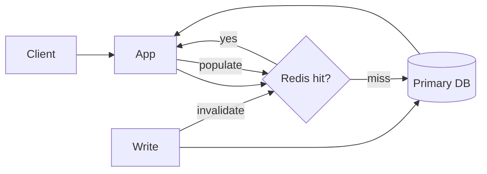

*Covers: reduce DB read load, stale cache, search index as derived store.*

---

### 🔵 Diagram · Thundering herd

**Without fix** — synchronized TTL expiry:

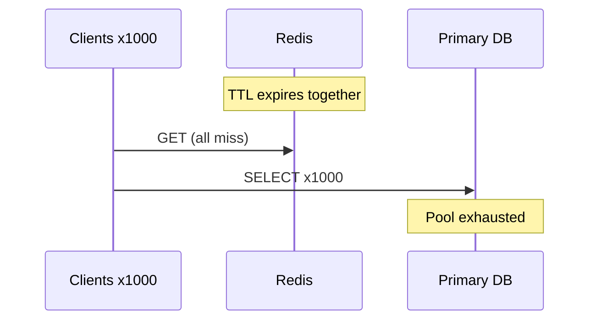

**With single-flight** — one repopulate, rest wait:

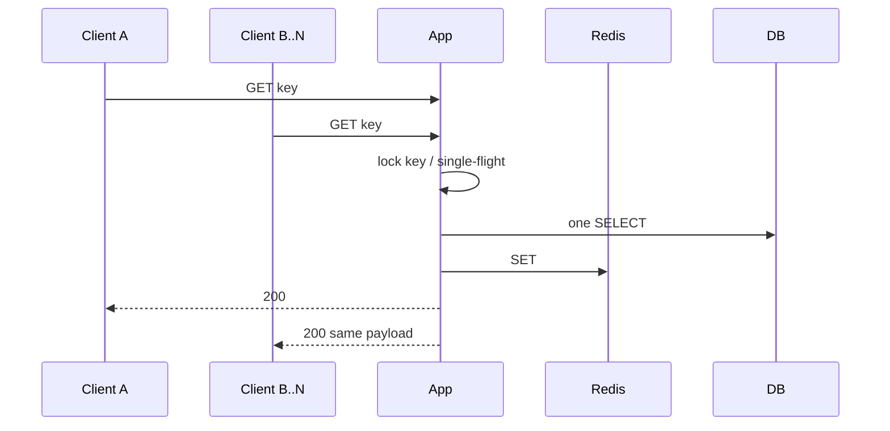

*Also covers: cache stampede — add "serve stale" branch while one worker refreshes.*

---

### 🔵 Diagram · Retry storm

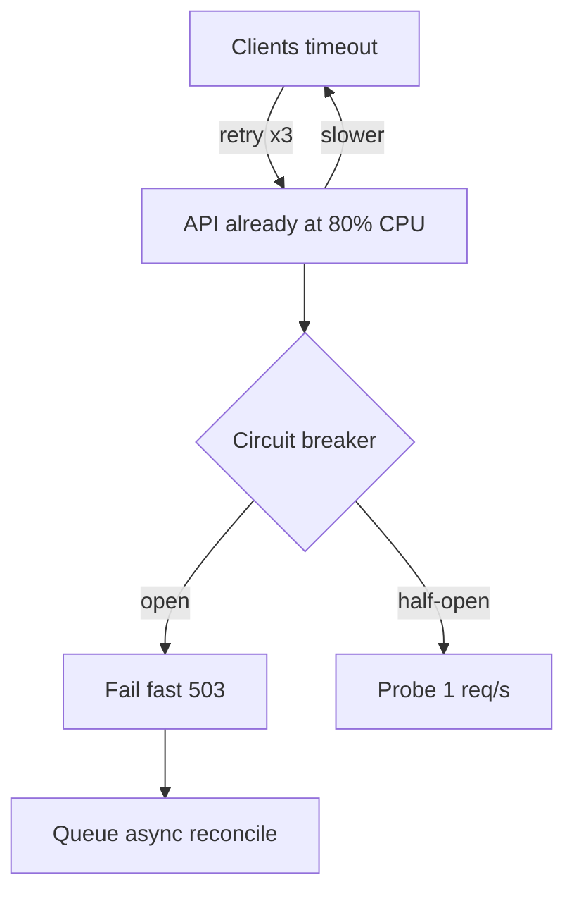

*Covers: retry storm, metastable failure, cascading failure.*

---

### 🔵 Diagram · Hot key

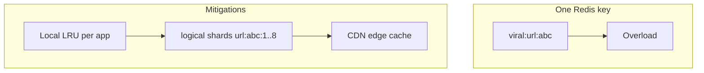

*Covers: hot partition, viral content, segmented counters.*

---

### 🔵 Diagram · Split brain

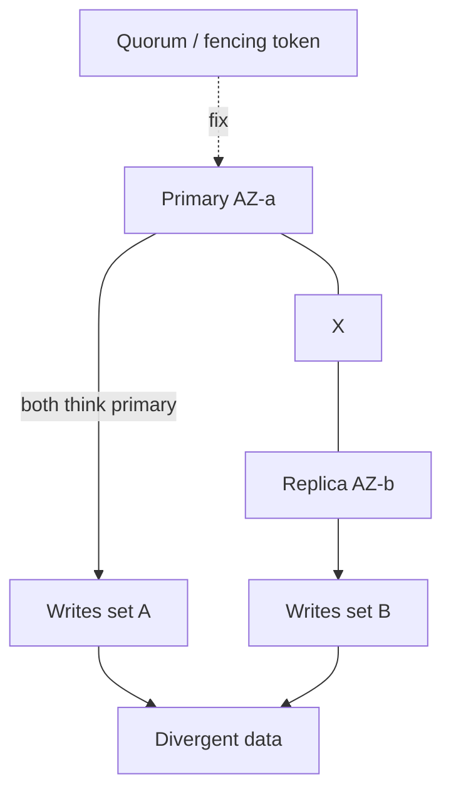

*Covers: split brain, DB failover edge cases.*

---

### 🔵 Diagram · Poison message

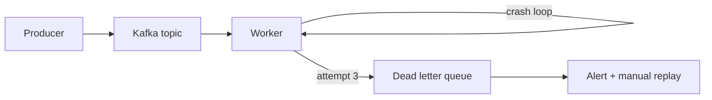

*Covers: poison message, head-of-line if worker stuck — use separate fast/slow topics.*

---

### 🔵 Diagram · N+1 vs batch

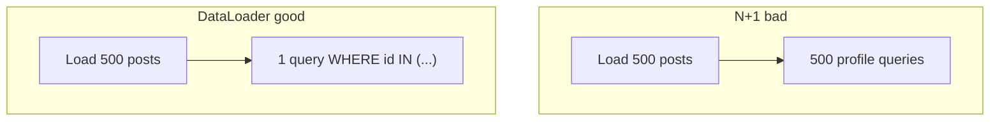

---

### 🔵 Diagram · Connection pool exhaustion

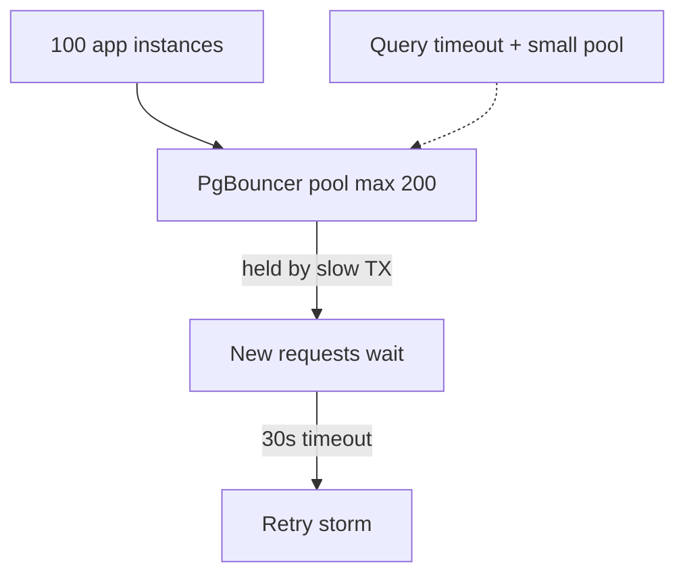

---

### 🔵 Diagram · Replica lag

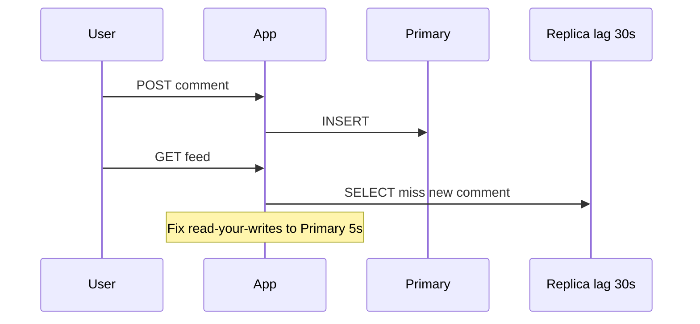

---

### 🔵 Diagram · Dual-write vs outbox

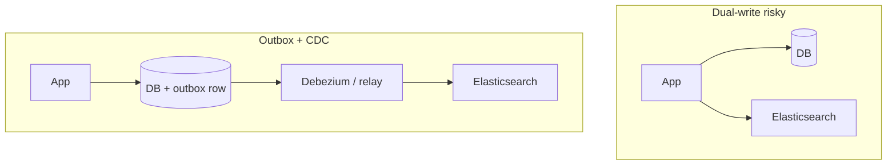

*Covers: dual-write problem, search index, webhook outbox.*

---

### 🔵 Diagram · Fan-out hybrid

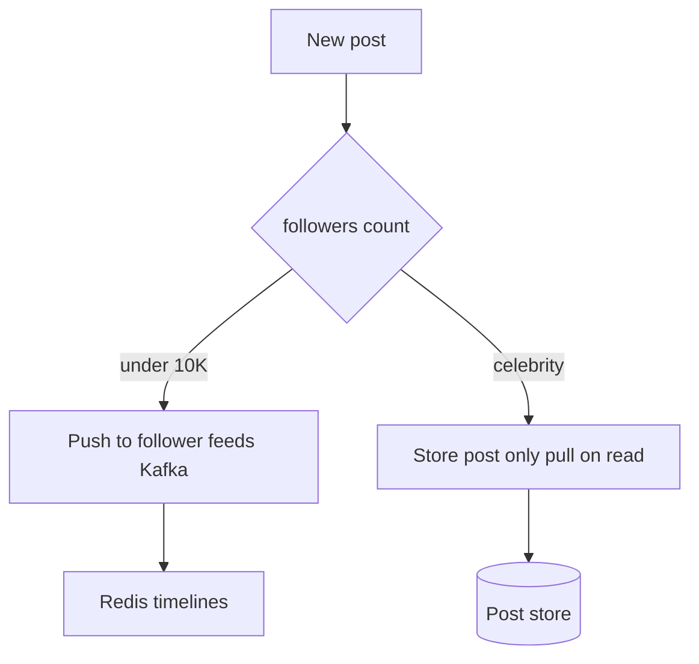

*Covers: fan-out millions, push notifications stagger.*

---

### 🔵 Diagram · Saga

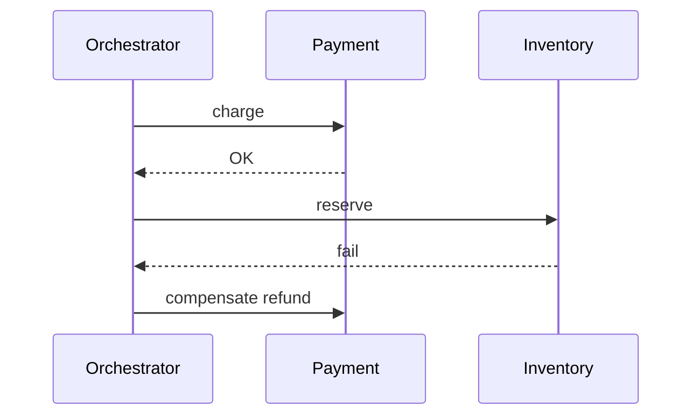

*Covers: cross-service transaction, payment + inventory.*

---

### 🔵 Diagram · Idempotency

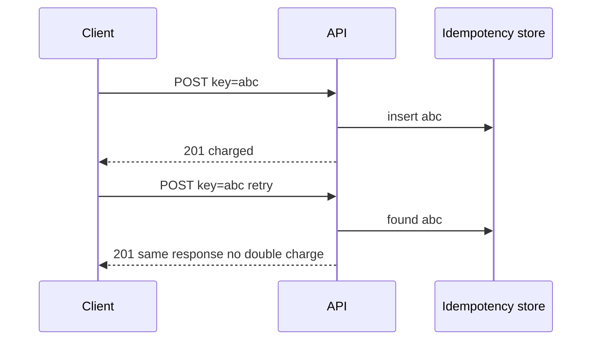

---

### 🔵 Diagram · Seat hold 2-phase

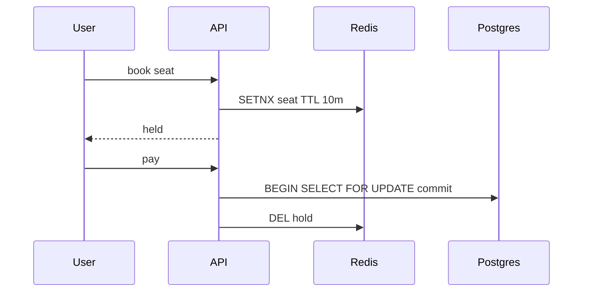

*Covers: prevent double booking, flash sale, inventory.*

---

### 🔵 Diagram · Scatter-gather straggler

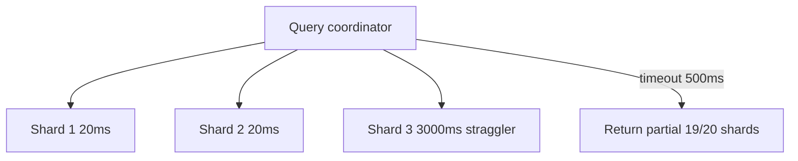

---

### 🔵 Pattern → diagram map

| Pattern | Diagram |
|---------|---------|
| Thundering herd, cache stampede | [Thundering herd](interview-quick-fire-diagrams.html#thundering-herd) |
| Retry storm, metastable, cascading failure | [Retry storm](interview-quick-fire-diagrams.html#retry-storm) |
| Hot key, hot partition, viral content | [Hot key](interview-quick-fire-diagrams.html#hot-key) |
| Split brain, DB failover | [Split brain](interview-quick-fire-diagrams.html#split-brain) |
| Poison message, head-of-line | [Poison message](interview-quick-fire-diagrams.html#poison-message) |
| N+1 queries | [N+1 vs batch](interview-quick-fire-diagrams.html#n1-batch) |
| Connection pool exhaustion | [Pool exhaustion](interview-quick-fire-diagrams.html#connection-pool) |
| Replica lag, read-your-writes | [Replica lag](interview-quick-fire-diagrams.html#replica-lag) |
| Dual-write, search index, webhooks | [Dual-write vs outbox](interview-quick-fire-diagrams.html#dual-write) |
| Reduce DB reads, stale cache | [Cache-aside](interview-quick-fire-diagrams.html#cache-aside) |
| Fan-out, push notifications | [Fan-out hybrid](interview-quick-fire-diagrams.html#fan-out) |
| Cross-service TX, payments | [Saga](interview-quick-fire-diagrams.html#saga) |
| Idempotent writes, payments | [Idempotency](interview-quick-fire-diagrams.html#idempotency) |
| Double booking, flash sale | [Seat hold](interview-quick-fire-diagrams.html#seat-hold) |
| Slow node / straggler | [Scatter-gather](interview-quick-fire-diagrams.html#straggler) |
| Rate limiting, DDoS | [Token bucket](interview-quick-fire-diagrams.html#token-bucket) |
| CDN / geo latency | Extend [cache-aside](interview-quick-fire-diagrams.html#cache-aside): Client → CDN → origin |
| WebSocket scale | [WebSocket at scale](interview-quick-fire-diagrams.html#websocket-scale) |

---

## Classic failure modes & distributed pitfalls

> [!CAUTION]
> **🔴 Critical** — Outage / data-loss risk — probe failure modes first


### 🔴 Thundering herd

> [!CAUTION]
> **🔴 Weak** — Add caching — TTL expires, everyone hits the DB.
>
> [!WARNING]
> **🟡 Strong** — Many clients miss cache (or TTL expires) at the same instant and all hit the origin/DB together. Fix with **request coalescing / single-flight** (one goroutine repopulates; others wait on the same future), **staggered TTL jitter** (±10–20% on expiry), **probabilistic early refresh** (background recompute before hard expiry), and **cache warming** after deploys. Add a **local in-process LRU** on app servers so the hottest keys never trigger a network miss storm.
>
> [!TIP]
> **🟢 Staff+** — Single-flight adds tail latency for waiters on cold miss. Jitter makes freshness less predictable per key. Local cache introduces per-node staleness — fine for redirects, wrong for inventory counts. Example: Redis restart during peak → 100% miss → Postgres connection pool exhausted in seconds. Netflix-style: mutex per key + early async refresh. Name metric + revisit trigger when they push depth.

**Trade-offs:** Single-flight adds tail latency for waiters on cold miss. Jitter makes freshness less predictable per key. Local cache introduces per-node staleness — fine for redirects, wrong for inventory counts.

**Example:** *Redis restart during peak → 100% miss → Postgres connection pool exhausted in seconds. Netflix-style: mutex per key + early async refresh.*

📊 **Visual:** [Thundering herd](interview-quick-fire-diagrams.html#thundering-herd)

### 🔴 Cache stampede (dogpile)

> [!CAUTION]
> **🔴 Weak** — Cache the expensive query with a fixed TTL.
>
> [!WARNING]
> **🟡 Strong** — Same family as thundering herd but specifically on **expensive recompute** (heavy DB query, ML ranker). Beyond single-flight: **lock with short lease**, **precompute in background** before TTL fires, **two-tier TTL** (soft expire → serve stale while one worker refreshes). For viral keys, **bypass cache logic entirely** — route to a dedicated read path or materialized view.
>
> [!TIP]
> **🟢 Staff+** — Serving stale during refresh trades UX accuracy for availability — must define max staleness SLA. Background refresh burns CPU on keys nobody reads (wasted work without hit-rate signal). Example: Feed ranker takes 200ms; 10K concurrent misses = 2K parallel rank jobs. Fix: one refresh job per `(user, feed)` key; readers get previous snapshot. Name metric + revisit trigger when they push depth.

**Trade-offs:** Serving stale during refresh trades UX accuracy for availability — must define max staleness SLA. Background refresh burns CPU on keys nobody reads (wasted work without hit-rate signal).

**Example:** *Feed ranker takes 200ms; 10K concurrent misses = 2K parallel rank jobs. Fix: one refresh job per `(user, feed)` key; readers get previous snapshot.*

📊 **Visual:** [Thundering herd](interview-quick-fire-diagrams.html#thundering-herd) *(add serve-stale branch)*

### 🔴 Retry storm

> [!CAUTION]
> **🔴 Weak** — Retry on any timeout — clients will eventually succeed.
>
> [!WARNING]
> **🟡 Strong** — Clients or middleware retry aggressively on timeout, **multiplying load on a already-degraded service**. Use **exponential backoff with jitter**, **retry budgets** (max N per request chain), **circuit breakers** that fail fast, and **429 + Retry-After** from the server. Idempotency keys on mutating retries so duplicates are safe.
>
> [!TIP]
> **🟢 Staff+** — Fewer retries increase user-visible errors during brief blips. Circuit open = hard failures — need half-open probes and alerting. Aggressive backoff slows recovery perception for humans. Example: Payment API at 80% CPU; clients retry 3× → effective load 240%. Breaker opens; queue for async reconciliation instead. Name metric + revisit trigger when they push depth.

**Trade-offs:** Fewer retries increase user-visible errors during brief blips. Circuit open = hard failures — need half-open probes and alerting. Aggressive backoff slows recovery perception for humans.

**Example:** *Payment API at 80% CPU; clients retry 3× → effective load 240%. Breaker opens; queue for async reconciliation instead.*

📊 **Visual:** [Retry storm](interview-quick-fire-diagrams.html#retry-storm)

### 🔴 Metastable failure

> [!CAUTION]
> **🔴 Weak** — Wait for autoscale; retries will fix it.
>
> [!WARNING]
> **🟡 Strong** — System has **two stable states** (healthy vs overloaded) and overload persists even after trigger is gone — retries, autoscale lag, GC piles, connection churn keep it stuck. Fix: **load shedding** early (drop low-priority work), **admission control** at edge, **enforce timeouts** everywhere, **disable retries** on read path under stress. Recovery often needs **manual traffic throttle**, not just "wait for autoscale."
>
> [!TIP]
> **🟢 Staff+** — Shedding load means deliberately failing some users to save the rest — product/policy decision. Turning off retries hurts success rate metrics during incidents (the right trade). Example: AWS ALB + Lambda cold starts + retry loops → hours of elevated errors after a 2-minute DB blip. Name metric + revisit trigger when they push depth.

**Trade-offs:** Shedding load means deliberately failing some users to save the rest — product/policy decision. Turning off retries hurts success rate metrics during incidents (the right trade).

**Example:** *AWS ALB + Lambda cold starts + retry loops → hours of elevated errors after a 2-minute DB blip.*

📊 **Visual:** [Retry storm](interview-quick-fire-diagrams.html#retry-storm) *(stuck in overload loop)*

### 🔴 Hot partition / hot key

> [!CAUTION]
> **🔴 Weak** — Scale Redis vertically when one key gets hot.
>
> [!WARNING]
> **🟡 Strong** — One shard or Redis key gets disproportionate traffic (celebrity tweet, viral URL, global counter). **Detect** via per-key QPS metrics. **Mitigate:** sub-key sharding (logical fan-out), **local cache** on app tier, **read replicas** dedicated to hot range, **async aggregation** (writes to buffer, periodic flush). For counters: **segmented counters** (shard add locally, sum on read).
>
> [!TIP]
> **🟢 Staff+** — Segmented counters make real-time exact counts harder. Local cache breaks global consistency. Splitting one hot key across shards complicates read path. Example: Justin Bieber tweet fan-out — Twitter switched to pull model for >10M follower accounts. Name metric + revisit trigger when they push depth.

**Trade-offs:** Segmented counters make real-time exact counts harder. Local cache breaks global consistency. Splitting one hot key across shards complicates read path.

**Example:** *Justin Bieber tweet fan-out — Twitter switched to pull model for >10M follower accounts.*

📊 **Visual:** [Hot key](interview-quick-fire-diagrams.html#hot-key) · [Fan-out hybrid](interview-quick-fire-diagrams.html#fan-out)

### 🔴 Split brain

> [!CAUTION]
> **🔴 Weak** — Promote replica on primary failure — keep serving writes.
>
> [!WARNING]
> **🟡 Strong** — Network partition causes **two nodes to believe they're primary** — risk of divergent writes. Prefer **quorum writes** (Raft/Paxos), **fencing tokens** (monotonic epoch; stale primary can't commit), **STONITH** in infra layers. For caches/locks: **Redlock is controversial** — say you'd use a consensus-backed lock or DB lease with TTL.
>
> [!TIP]
> **🟢 Staff+** — Quorum adds latency and needs odd number of AZs. Fencing requires plumbing through all storage layers. Availability during partition: CP systems reject writes (unavailable), AP systems risk inconsistency. Example: Redis primary + async replica both promoted after partition → duplicate short codes. Fix: etcd lease + single writer. Name metric + revisit trigger when they push depth.

**Trade-offs:** Quorum adds latency and needs odd number of AZs. Fencing requires plumbing through all storage layers. Availability during partition: CP systems reject writes (unavailable), AP systems risk inconsistency.

**Example:** *Redis primary + async replica both promoted after partition → duplicate short codes. Fix: etcd lease + single writer.*

📊 **Visual:** [Split brain](interview-quick-fire-diagrams.html#split-brain)

### 🔴 Poison message

> [!CAUTION]
> **🔴 Weak** — Restart the consumer until the message processes.
>
> [!WARNING]
> **🟡 Strong** — One bad message crashes consumer in a loop (malformed payload, unexpected schema). **DLQ** after N attempts, **schema validation** at ingest, **poison pill quarantine** with alert. Replay DLQ only after fix deployed. Separate **canary consumer** on new schema versions.
>
> [!TIP]
> **🟢 Staff+** — DLQ delays processing for bad messages (operational toil). Strict validation rejects valid edge cases if schema too tight. Example: Kafka consumer OOM on 12MB JSON → partition stuck. Move to DLQ; fix deserializer; replay with size cap. Name metric + revisit trigger when they push depth.

**Trade-offs:** DLQ delays processing for bad messages (operational toil). Strict validation rejects valid edge cases if schema too tight.

**Example:** *Kafka consumer OOM on 12MB JSON → partition stuck. Move to DLQ; fix deserializer; replay with size cap.*

📊 **Visual:** [Poison message](interview-quick-fire-diagrams.html#poison-message)

### 🔴 Head-of-line blocking

> [!CAUTION]
> **🔴 Weak** — One worker pool for all job types.
>
> [!WARNING]
> **🟡 Strong** — One slow item blocks entire queue (FIFO worker stuck on huge job). Use **multiple queues by SLA**, **priority queues**, **separate thread pools per task type**, **bounded work stealing**. For HTTP: don't share one pool between fast reads and slow reports.
>
> [!TIP]
> **🟢 Staff+** — More queues = more ops complexity and potential starvation of low-priority work. Priority inversion if not careful with shared resources. Example: Video transcode 40 min blocks thumbnail job. Dedicated `fast` and `slow` Kafka topics. Name metric + revisit trigger when they push depth.

**Trade-offs:** More queues = more ops complexity and potential starvation of low-priority work. Priority inversion if not careful with shared resources.

**Example:** *Video transcode 40 min blocks thumbnail job. Dedicated `fast` and `slow` Kafka topics.*

📊 **Visual:** [Poison message](interview-quick-fire-diagrams.html#poison-message) *(split fast/slow queues)*

### 🔴 N+1 queries

> [!CAUTION]
> **🔴 Weak** — Load related rows in a loop — simple and correct.
>
> [!WARNING]
> **🟡 Strong** — Loop loads parent rows then one query per child — collapses at scale. Fix with **JOIN + batch load**, **DataLoader pattern** (batch IDs per request), **denormalized read model** for hot paths. In microservices: **graphQL batch endpoint** or materialized view — not 50 sequential RPCs.
>
> [!TIP]
> **🟢 Staff+** — JOINs couple schemas; denormalization adds sync lag. Batching adds latency within single request (wait for batch window). Example: Feed loads 500 authors each with a profile query → 501 DB roundtrips. Batch `WHERE id IN (...)`. Name metric + revisit trigger when they push depth.

**Trade-offs:** JOINs couple schemas; denormalization adds sync lag. Batching adds latency within single request (wait for batch window).

**Example:** *Feed loads 500 authors each with a profile query → 501 DB roundtrips. Batch `WHERE id IN (...)`.*

📊 **Visual:** [N+1 vs batch](interview-quick-fire-diagrams.html#n1-batch)

### 🔴 Connection pool exhaustion

> [!CAUTION]
> **🔴 Weak** — Increase max connections on the database.
>
> [!WARNING]
> **🟡 Strong** — App holds DB connections too long (slow queries, missing `finally close`, transaction scope too wide). **Right-size pool** (often tens, not thousands per instance), **query timeouts**, **pgbouncer/RDS proxy** for multiplexing, **reject** when pool saturated instead of queuing forever. Monitor **waiting thread count**.
>
> [!TIP]
> **🟢 Staff+** — Small pools limit per-instance throughput — scale horizontally instead. Proxy adds hop latency and single point of failure if not HA. Example: Deploy leak leaves connections open → new requests hang 30s. Alert on `pool.waiting > 0`. Name metric + revisit trigger when they push depth.

**Trade-offs:** Small pools limit per-instance throughput — scale horizontally instead. Proxy adds hop latency and single point of failure if not HA.

**Example:** *Deploy leak leaves connections open → new requests hang 30s. Alert on `pool.waiting > 0`.*

📊 **Visual:** [Connection pool](interview-quick-fire-diagrams.html#connection-pool)

### 🔴 Replica lag / stale read

> [!CAUTION]
> **🔴 Weak** — Add read replicas and route all reads there.
>
> [!WARNING]
> **🟡 Strong** — Read replica serves data seconds behind primary — user sees own write missing. **Route read-your-writes to primary** (or sticky session), **monitor replication lag** and drop replica from pool if > threshold, **version tokens** in API so client knows staleness.
>
> [!TIP]
> **🟢 Staff+** — Primary reads reduce scale benefit of replicas. Lag threshold tuning is workload-specific (feeds OK, banking not). Example: User posts comment, refresh shows nothing — read hit 30s-lagged replica. Session stickiness to primary for 5s after write. Name metric + revisit trigger when they push depth.

**Trade-offs:** Primary reads reduce scale benefit of replicas. Lag threshold tuning is workload-specific (feeds OK, banking not).

**Example:** *User posts comment, refresh shows nothing — read hit 30s-lagged replica. Session stickiness to primary for 5s after write.*

📊 **Visual:** [Replica lag](interview-quick-fire-diagrams.html#replica-lag)

### 🔴 Slow node (straggler)

> [!CAUTION]
> **🔴 Weak** — Wait for the slowest shard — correctness first.
>
> [!WARNING]
> **🟡 Strong** — One shard/node at 99th percentile kills scatter-gather (MapReduce, multi-shard query). **Speculative duplicate requests** (hedged reads), **timeout per shard** and return partial results, **rebalance** hot nodes, **avoid co-tenancy** of heavy tenants.
>
> [!TIP]
> **🟢 Staff+** — Hedged reads double load on recovery path. Partial results complicate API contract. Example: ES query across 20 shards; one shard on noisy neighbor → p99 3s. Cancel straggler at 500ms; return 19/20. Name metric + revisit trigger when they push depth.

**Trade-offs:** Hedged reads double load on recovery path. Partial results complicate API contract.

**Example:** *ES query across 20 shards; one shard on noisy neighbor → p99 3s. Cancel straggler at 500ms; return 19/20.*

📊 **Visual:** [Scatter-gather straggler](interview-quick-fire-diagrams.html#straggler)

### 🔴 Dual-write problem

> [!CAUTION]
> **🔴 Weak** — Write to DB and cache in the same request handler.
>
> [!WARNING]
> **🟡 Strong** — Writing to DB and cache (or ES) in application code without atomicity — crash between writes causes permanent drift. Prefer **CDC / transactional outbox** → async projector updates derived store. Cache: **cache-aside** with DB as source of truth, not write-through from app dual paths.
>
> [!TIP]
> **🟢 Staff+** — CDC adds lag to search index. Outbox requires consumer ops. Cache-aside has miss path complexity. Example: Write PG succeeds, ES write fails — search missing new row until nightly rebuild. Outbox + indexer. Name metric + revisit trigger when they push depth.

**Trade-offs:** CDC adds lag to search index. Outbox requires consumer ops. Cache-aside has miss path complexity.

**Example:** *Write PG succeeds, ES write fails — search missing new row until nightly rebuild. Outbox + indexer.*

📊 **Visual:** [Dual-write vs outbox](interview-quick-fire-diagrams.html#dual-write)

### 🔴 Circular dependency / retry loop

> [!CAUTION]
> **🔴 Weak** — Service A calls B calls A with retries enabled.
>
> [!WARNING]
> **🟡 Strong** — Service A calls B calls A, or retry policies form a loop under failure. **Timeouts + max depth headers**, **acyclic dependency rules** in architecture review, **async handoff** at boundaries. Break sync cycles with queue.
>
> [!TIP]
> **🟢 Staff+** — Async adds UX latency for completion. Strict layering can feel bureaucratic but prevents outage amplification. Example: Auth service calls User service calls Auth for permission — deadlock under load. Extract permissions cache. Name metric + revisit trigger when they push depth.

**Trade-offs:** Async adds UX latency for completion. Strict layering can feel bureaucratic but prevents outage amplification.

**Example:** *Auth service calls User service calls Auth for permission — deadlock under load. Extract permissions cache.*

📊 **Visual:** [Retry storm](interview-quick-fire-diagrams.html#retry-storm) *(draw A→B→A cycle; break with queue)*

### 🟢 Reduce DB read load

> [!CAUTION]
> **🔴 Weak** — Put Redis in front of the database.
>
> [!WARNING]
> **🟡 Strong** — **Read replicas** for fan-out; **Redis cache-aside** for hot keys (app reads cache → on miss read DB → populate). Target **>90% hit rate** on read-heavy paths. **Invalidate or TTL** on write; never treat cache as source of truth.
>
> [!TIP]
> **🟢 Staff+** — Replica lag → stale reads unless you route critical reads to primary. Cache invalidation bugs cause subtle data bugs. Memory cost scales with working set. Example: Netflix ~95% API traffic served from EVCache/Memcached layer. Name metric + revisit trigger when they push depth.

**Trade-offs:** Replica lag → stale reads unless you route critical reads to primary. Cache invalidation bugs cause subtle data bugs. Memory cost scales with working set.

**Example:** *Netflix ~95% API traffic served from EVCache/Memcached layer.*

📊 **Visual:** [Cache-aside](interview-quick-fire-diagrams.html#cache-aside)

### 🟢 Hot key / viral content

> [!CAUTION]
> **🔴 Weak** — Bigger Redis instance when a celebrity posts.
>
> [!WARNING]
> **🟡 Strong** — Three layers: **local LRU** (microseconds, per process) → **Redis cluster** (milliseconds) → **DB/CDN**. Instrument per-key QPS; alert at 1K RPS/key. For global counters use **sharded counters** or **HyperLogLog** if approximate OK.
>
> [!TIP]
> **🟢 Staff+** — Local cache = inconsistent across fleet. Sharded counters lose O(1) global exact count. CDN caching of dynamic data needs short TTL + purge playbook. Example: Viral Bitly link — single Redis key melts. Local LRU + CDN 302 caching for top-N URLs. Name metric + revisit trigger when they push depth.

**Trade-offs:** Local cache = inconsistent across fleet. Sharded counters lose O(1) global exact count. CDN caching of dynamic data needs short TTL + purge playbook.

**Example:** *Viral Bitly link — single Redis key melts. Local LRU + CDN 302 caching for top-N URLs.*

📊 **Visual:** [Hot key](interview-quick-fire-diagrams.html#hot-key)

### 🟢 Stale cache after update

> [!CAUTION]
> **🔴 Weak** — Delete cache key on every write — always consistent.
>
> [!WARNING]
> **🟡 Strong** — **Write-invalidate** (delete cache key on mutation) or **write-through** for low-cardinality entities. TTL as safety net only. For feeds, expose **version / `updated_at`** so UI can reconcile.
>
> [!TIP]
> **🟢 Staff+** — Invalidate on every write reduces hit rate for churny keys. Write-through adds write latency. Versioned UI adds client complexity. Example: Profile name change — `DEL user:123` in Redis on PG commit. Name metric + revisit trigger when they push depth.

**Trade-offs:** Invalidate on every write reduces hit rate for churny keys. Write-through adds write latency. Versioned UI adds client complexity.

**Example:** *Profile name change — `DEL user:123` in Redis on PG commit.*

### 🟢 Reduce global read latency

> [!CAUTION]
> **🔴 Weak** — Deploy one big CDN in the US — covers everyone.
>
> [!WARNING]
> **🟡 Strong** — **CDN** for static and cacheable API responses. **GeoDNS / latency-based routing** to nearest region. **Read replicas per region** with async replication; accept staleness or conflict rules for multi-master.
>
> [!TIP]
> **🟢 Staff+** — Multi-region consistency is hard (CAP). CDN cache invalidation is slow and costs money. Data residency laws may forbid cross-border copies. Example: Cloudflare 300+ PoPs; HLS video segments `max-age=86400`. Name metric + revisit trigger when they push depth.

**Trade-offs:** Multi-region consistency is hard (CAP). CDN cache invalidation is slow and costs money. Data residency laws may forbid cross-border copies.

**Example:** *Cloudflare 300+ PoPs; HLS video segments `max-age=86400`.*

### 🟢 Pagination at scale

> [!CAUTION]
> **🔴 Weak** — OFFSET/LIMIT — page 10,000 is fine if indexed.
>
> [!WARNING]
> **🟡 Strong** — **Keyset / cursor** pagination (`WHERE (ts, id) < cursor ORDER BY ts DESC LIMIT 20`). Never `OFFSET` on large tables — O(n) scans. Cursor is opaque blob encoding last seen tuple.
>
> [!TIP]
> **🟢 Staff+** — No "jump to page 47" without walking cursors. Stable sort key required; composite index design matters. Example: Twitter timelines — snowflake ID as cursor, not page numbers. Name metric + revisit trigger when they push depth.

**Trade-offs:** No "jump to page 47" without walking cursors. Stable sort key required; composite index design matters.

**Example:** *Twitter timelines — snowflake ID as cursor, not page numbers.*

### 🟢 Search across billions of records

> [!CAUTION]
> **🔴 Weak** — SELECT * WHERE title LIKE '%query%'.
>
> [!WARNING]
> **🟡 Strong** — **Elasticsearch** (or similar) as **derived index**. Ingest via CDC (Debezium) or dual-write outbox. Primary DB remains source of truth; ES rebuilt from snapshot + CDC if lost.
>
> [!TIP]
> **🟢 Staff+** — Index lag (seconds). Denormalized docs drift from normalized DB. Cluster ops and mapping migrations are non-trivial. Example: Shopify product search — PG → Kafka → ES; rebuild index from PG snapshot overnight. Name metric + revisit trigger when they push depth.

**Trade-offs:** Index lag (seconds). Denormalized docs drift from normalized DB. Cluster ops and mapping migrations are non-trivial.

**Example:** *Shopify product search — PG → Kafka → ES; rebuild index from PG snapshot overnight.*

📊 **Visual:** [Dual-write vs outbox](interview-quick-fire-diagrams.html#dual-write)

### 🟢 Autocomplete / typeahead

> [!CAUTION]
> **🔴 Weak** — Prefix scan on the users table on every keystroke.
>
> [!WARNING]
> **🟡 Strong** — Offline **MapReduce** on query logs → **prefix → top-K** in Redis. Online path: debounce 100ms, `HGET prefix`, CDN for top 10K prefixes. Fuzzy match optional second tier (ES).
>
> [!TIP]
> **🟢 Staff+** — Weekly rebuild = stale trending queries. Top-K only — no full corpus scan at keystroke. Privacy: aggregate logs, don't store raw PII queries. Example: Google Suggest — precomputed trie shards + aggressive CDN. Name metric + revisit trigger when they push depth.

**Trade-offs:** Weekly rebuild = stale trending queries. Top-K only — no full corpus scan at keystroke. Privacy: aggregate logs, don't store raw PII queries.

**Example:** *Google Suggest — precomputed trie shards + aggressive CDN.*

### 🟢 Scale writes past single DB

> [!CAUTION]
> **🔴 Weak** — Shard later when Postgres is full.
>
> [!WARNING]
> **🟡 Strong** — **Vertical scale** until pain is real, then **shard** by high-cardinality key (`user_id`, `tenant_id`). Alternative: **append-only** store (Cassandra, DynamoDB) for write-heavy access patterns. **Denormalize** — one physical table per query pattern (CQRS).
>
> [!TIP]
> **🟢 Staff+** — Sharding kills cross-shard JOINs and global transactions. Cassandra tuning (consistency level, compaction) is specialized. Premature sharding is ops nightmare. Example: Instagram shards media metadata by `user_id` when single PG master saturated. Name metric + revisit trigger when they push depth.

**Trade-offs:** Sharding kills cross-shard JOINs and global transactions. Cassandra tuning (consistency level, compaction) is specialized. Premature sharding is ops nightmare.

**Example:** *Instagram shards media metadata by `user_id` when single PG master saturated.*

### 🟠 High write burst (flash sale)

> [!CAUTION]
> **🔴 Weak** — Queue everyone in one mutex — fairness first.
>
> [!WARNING]
> **🟡 Strong** — **Queue** purchase intents (Kafka/SQS). **Redis decr** or token bucket for inventory pre-check. **Single-row transaction** on PG for final commit. **Waitroom** / token at edge (Cloudflare Waiting Room) before API.
>
> [!TIP]
> **🟢 Staff+** — Queue adds seconds of latency to confirmation. Redis pre-check can oversell if not reconciled with DB — DB must be final arbiter. Example: Ticketmaster — virtual queue + Redis seat hold TTL + PG `SELECT FOR UPDATE`. Name metric + revisit trigger when they push depth.

**Trade-offs:** Queue adds seconds of latency to confirmation. Redis pre-check can oversell if not reconciled with DB — DB must be final arbiter.

**Example:** *Ticketmaster — virtual queue + Redis seat hold TTL + PG `SELECT FOR UPDATE`.*

📊 **Visual:** [Seat hold 2-phase](interview-quick-fire-diagrams.html#seat-hold)

### 🟢 Idempotent writes

> [!CAUTION]
> **🔴 Weak** — Check if row exists, then INSERT — good enough.
>
> [!WARNING]
> **🟡 Strong** — Client sends **`Idempotency-Key`** (UUID). Server stores `(key → response)` in Redis/DB with 24h TTL. Duplicate request returns cached response without re-executing side effects.
>
> [!TIP]
> **🟢 Staff+** — Storage for keys. Key scope definition (per user vs global). Retries must send same key and body. Example: Stripe — same idempotency key on network retry never double-charges. Name metric + revisit trigger when they push depth.

**Trade-offs:** Storage for keys. Key scope definition (per user vs global). Retries must send same key and body.

**Example:** *Stripe — same idempotency key on network retry never double-charges.*

📊 **Visual:** [Idempotency](interview-quick-fire-diagrams.html#idempotency)

### 🟠 Prevent double booking

> [!CAUTION]
> **🔴 Weak** — SELECT then UPDATE in application code.
>
> [!WARNING]
> **🟡 Strong** — **Pessimistic:** `SELECT FOR UPDATE` in transaction. **Optimistic:** version column `UPDATE ... WHERE version = ?`. Always **idempotency key** on client retries. Fail closed on conflict (409), never silent overwrite.
>
> [!TIP]
> **🟢 Staff+** — Pessimistic locks reduce concurrency (hot row serialization). Optimistic fails under high contention — need UX retry. Example: Airline seat map — row lock on `seat_id` for duration of checkout session. Name metric + revisit trigger when they push depth.

**Trade-offs:** Pessimistic locks reduce concurrency (hot row serialization). Optimistic fails under high contention — need UX retry.

**Example:** *Airline seat map — row lock on `seat_id` for duration of checkout session.*

📊 **Visual:** [Seat hold 2-phase](interview-quick-fire-diagrams.html#seat-hold)

### 🟢 Distributed counter

> [!CAUTION]
> **🔴 Weak** — INCR one global Redis key for all traffic.
>
> [!WARNING]
> **🟡 Strong** — **Redis INCR** for real-time; **batch flush** to DB every N seconds. Or **pre-allocated ranges** per server (Snowflake-style). Never `read → add → write` in app without CAS.
>
> [!TIP]
> **🟢 Staff+** — Flush window loses counts on Redis failure unless AOF enabled. Range allocation can leave gaps on crash. Example: YouTube view counter — approximate counts OK; HyperLogLog or batched increments. Name metric + revisit trigger when they push depth.

**Trade-offs:** Flush window loses counts on Redis failure unless AOF enabled. Range allocation can leave gaps on crash.

**Example:** *YouTube view counter — approximate counts OK; HyperLogLog or batched increments.*

### 🟢 Unique ID at scale

> [!CAUTION]
> **🔴 Weak** — UUID v4 everywhere — collisions are negligible.
>
> [!WARNING]
> **🟡 Strong** — **Snowflake** (time + machine + sequence) for sortable 64-bit IDs. **UUID v7** for distributed without coordination. **DB sequence** with `hi/lo` allocation per app instance for simplicity.
>
> [!TIP]
> **🟢 Staff+** — Snowflake needs clock sync and machine ID registry. UUIDs aren't human-friendly. Sequential IDs leak growth rate. Example: Twitter Snowflake — roughly time-ordered tweets without central DB. Name metric + revisit trigger when they push depth.

**Trade-offs:** Snowflake needs clock sync and machine ID registry. UUIDs aren't human-friendly. Sequential IDs leak growth rate.

**Example:** *Twitter Snowflake — roughly time-ordered tweets without central DB.*

### 🟠 Handle traffic spikes

> [!CAUTION]
> **🔴 Weak** — Autoscale app servers; the DB will keep up.
>
> [!WARNING]
> **🟡 Strong** — **Stateless** app tier behind LB + **autoscale** on CPU/RPS/queue depth. **Absorb burst** in Kafka/SQS. **Circuit breakers** on downstreams. **Rate limit** at edge before origin melts.
>
> [!TIP]
> **🟢 Staff+** — Autoscale lags minutes — need buffer (queue) or pre-warming for known events. Breakers cause errors for edge cases during recovery. Example: Shopify Black Friday — checkout writes queued; read path scaled horizontally. Name metric + revisit trigger when they push depth.

**Trade-offs:** Autoscale lags minutes — need buffer (queue) or pre-warming for known events. Breakers cause errors for edge cases during recovery.

**Example:** *Shopify Black Friday — checkout writes queued; read path scaled horizontally.*

### 🟠 Eliminate single point of failure

> [!CAUTION]
> **🔴 Weak** — Run two of everything in one AZ.
>
> [!WARNING]
> **🟡 Strong** — Redundancy at **every** tier: 2+ LBs (anycast or DNS failover), N app instances, DB **primary + sync replica**, Redis **primary + replica**, multi-AZ. **Health checks** remove unhealthy targets; **chaos drills** prove it works.
>
> [!TIP]
> **🟢 Staff+** — Cost doubles (or more). Split-brain risk if failover automation wrong. Complexity of active-active vs active-passive. Example: RDS Multi-AZ — sync standby promotion on primary failure. Name metric + revisit trigger when they push depth.

**Trade-offs:** Cost doubles (or more). Split-brain risk if failover automation wrong. Complexity of active-active vs active-passive.

**Example:** *RDS Multi-AZ — sync standby promotion on primary failure.*

### 🟠 DB primary fails

> [!CAUTION]
> **🔴 Weak** — Manual failover when someone pages you.
>
> [!WARNING]
> **🟡 Strong** — Automated **failover** to sync replica (Orchestrator, Patroni, RDS Multi-AZ). Apps use **DNS/connection string** that updates or **proxy** (PgBouncer, RDS Proxy). **Retry with backoff** on transient connection errors.
>
> [!TIP]
> **🟢 Staff+** — Failover takes 15–60s — in-flight transactions fail. Sync replica lag = data loss window if async (unacceptable for money). Example: Payments — sync replication only; accept unavailable during AZ failure, not wrong balance. Name metric + revisit trigger when they push depth.

**Trade-offs:** Failover takes 15–60s — in-flight transactions fail. Sync replica lag = data loss window if async (unacceptable for money).

**Example:** *Payments — sync replication only; accept unavailable during AZ failure, not wrong balance.*

### 🟠 Cascading failure

> [!CAUTION]
> **🔴 Weak** — Retry until downstream recovers.
>
> [!WARNING]
> **🟡 Strong** — **Timeouts** < client deadline everywhere. **Bulkheads** (separate pools for critical vs batch). **Circuit breakers** stop calling sick deps. **Load shed** non-critical endpoints first (recommendations off, core checkout on).
>
> [!TIP]
> **🟢 Staff+** — Shedding angers users on deprioritized features. Tight timeouts cause false failures on slow but healthy deps — tune per dependency. Example: Netflix Hystrix-era pattern — fallback static list when recommendation service down. Name metric + revisit trigger when they push depth.

**Trade-offs:** Shedding angers users on deprioritized features. Tight timeouts cause false failures on slow but healthy deps — tune per dependency.

**Example:** *Netflix Hystrix-era pattern — fallback static list when recommendation service down.*

📊 **Visual:** [Retry storm](interview-quick-fire-diagrams.html#retry-storm)

### 🟠 Regional outage

> [!CAUTION]
> **🔴 Weak** — Multi-region active-active from day one.
>
> [!WARNING]
> **🟡 Strong** — **Multi-region** deployment with GeoDNS failover. Define **RPO/RTO** per service. **Active-passive** for strong consistency workloads; **active-active** only with conflict resolution story.
>
> [!TIP]
> **🟢 Staff+** — Active-active cross-region writes need CRDTs, last-write-wins, or partitioned tenants. Failover drills required — DNS TTL stalls traffic shift. Example: S3 cross-region replication for media; API active-passive with Route53 health checks. Name metric + revisit trigger when they push depth.

**Trade-offs:** Active-active cross-region writes need CRDTs, last-write-wins, or partitioned tenants. Failover drills required — DNS TTL stalls traffic shift.

**Example:** *S3 cross-region replication for media; API active-passive with Route53 health checks.*

### 🟠 Zero-downtime deploy

> [!CAUTION]
> **🔴 Weak** — Rolling restart — users won't notice brief errors.
>
> [!WARNING]
> **🟡 Strong** — **Rolling deploy** behind LB (drain connections). **Readiness vs liveness** probes. **Feature flags** for risky code paths. **Blue-green** or **canary** (1% traffic) with automatic rollback on error budget burn.
>
> [!TIP]
> **🟢 Staff+** — Two versions running during rollout — schema must be backward compatible. Canary needs traffic routing infra. Example: Kubernetes rolling update `maxUnavailable: 0` + PDB. Name metric + revisit trigger when they push depth.

**Trade-offs:** Two versions running during rollout — schema must be backward compatible. Canary needs traffic routing infra.

**Example:** *Kubernetes rolling update `maxUnavailable: 0` + PDB.*

### 🟣 Strong vs eventual consistency

> [!CAUTION]
> **🔴 Weak** — Always use strong consistency — users hate stale data.
>
> [!WARNING]
> **🟡 Strong** — Draw a line: **strong (ACID)** where invariants matter (money, inventory, seat). **Eventual** for search index, analytics, activity feeds. Say aloud: *"This path is AP; users may see 2s lag."*
>
> [!TIP]
> **🟢 Staff+** — Strong limits throughput and complicates geo distribution. Eventual needs UX that tolerates staleness or self-corrects. Example: Bank transfer — PG transaction. Instagram like count — eventual + periodic reconcile. Name metric + revisit trigger when they push depth.

**Trade-offs:** Strong limits throughput and complicates geo distribution. Eventual needs UX that tolerates staleness or self-corrects.

**Example:** *Bank transfer — PG transaction. Instagram like count — eventual + periodic reconcile.*

### 🟣 Guarantee exactly-once

> [!CAUTION]
> **🔴 Weak** — Kafka exactly-once semantics solve it end-to-end.
>
> [!WARNING]
> **🟡 Strong** — True exactly-once needs **distributed transactions (2PC)** or **Kafka transactions** — expensive and fragile. Default: **at-least-once delivery + idempotent consumer** + dedup store. Document: *"Duplicates possible but harmless."*
>
> [!TIP]
> **🟢 Staff+** — Idempotency design burden on every handler. 2PC blocks on coordinator failure. Example: Payment webhook — store `event_id` before crediting wallet. Name metric + revisit trigger when they push depth.

**Trade-offs:** Idempotency design burden on every handler. 2PC blocks on coordinator failure.

**Example:** *Payment webhook — store `event_id` before crediting wallet.*

### 🟣 Cross-service transaction

> [!CAUTION]
> **🔴 Weak** — Two-phase commit across all microservices.
>
> [!WARNING]
> **🟡 Strong** — Avoid 2PC across microservices. Use **saga**: local TX + event; on downstream failure run **compensating transaction** (refund, cancel hold). **Outbox pattern** ensures event published iff local commit.
>
> [!TIP]
> **🟢 Staff+** — Sagas are eventually consistent — intermediate states visible. Compensation logic is easy to get wrong (need idempotent compensations). Example: Travel booking — reserve flight → reserve hotel; if hotel fails, saga publishes cancel-flight. Name metric + revisit trigger when they push depth.

**Trade-offs:** Sagas are eventually consistent — intermediate states visible. Compensation logic is easy to get wrong (need idempotent compensations).

**Example:** *Travel booking — reserve flight → reserve hotel; if hotel fails, saga publishes cancel-flight.*

📊 **Visual:** [Saga](interview-quick-fire-diagrams.html#saga)

### 🟣 Read-your-writes

> [!CAUTION]
> **🔴 Weak** — Sticky sessions to any random replica.
>
> [!WARNING]
> **🟡 Strong** — After write, route that user's reads to **primary** or **sticky session** to leader for N seconds. Or return **updated entity in write response** so client doesn't need immediate re-read.
>
> [!TIP]
> **🟢 Staff+** — Primary reads reduce replica utility. Stickiness complicates load balancing. Example: Post tweet — API returns tweet object; timeline refresh uses primary for 3s. Name metric + revisit trigger when they push depth.

**Trade-offs:** Primary reads reduce replica utility. Stickiness complicates load balancing.

**Example:** *Post tweet — API returns tweet object; timeline refresh uses primary for 3s.*

📊 **Visual:** [Replica lag](interview-quick-fire-diagrams.html#replica-lag)

### 🟢 Fan-out to millions of followers

> [!CAUTION]
> **🔴 Weak** — Push every post to every follower's feed on write.
>
> [!WARNING]
> **🟡 Strong** — **Hybrid fan-out:** push (precompute timeline on write) for normal accounts; **pull** (assemble on read) for celebrities above threshold (e.g. 10K followers). **Kafka** for async fan-out workers; **Cassandra/Redis** for timeline storage.
>
> [!TIP]
> **🟢 Staff+** — Push wastes work for inactive followers. Pull makes celebrity read slow — cache materialized partial feeds. Example: Twitter — push for most; pull for Bieber-class accounts. Name metric + revisit trigger when they push depth.

**Trade-offs:** Push wastes work for inactive followers. Pull makes celebrity read slow — cache materialized partial feeds.

**Example:** *Twitter — push for most; pull for Bieber-class accounts.*

📊 **Visual:** [Fan-out hybrid](interview-quick-fire-diagrams.html#fan-out)

### 🟢 WebSocket at scale

> [!CAUTION]
> **🔴 Weak** — One giant WebSocket server holds all connections.
>
> [!WARNING]
> **🟡 Strong** — **Dedicated connection tier** scaled separately from API. **Sticky sessions** or **pub/sub bridge** (Redis/Kafka) so any server can push to user on any connection server. **Connection registry:** `user_id → server_id`.
>
> [!TIP]
> **🟢 Staff+** — Sticky sessions complicate deploys and imbalance load. Pub/sub adds latency vs local-only push. Example: Slack — channel-based pub/sub; co-locate busy channels where possible. Name metric + revisit trigger when they push depth.

**Trade-offs:** Sticky sessions complicate deploys and imbalance load. Pub/sub adds latency vs local-only push.

**Example:** *Slack — channel-based pub/sub; co-locate busy channels where possible.*

### 🟢 Push notifications at scale

> [!CAUTION]
> **🔴 Weak** — Loop over all device tokens and send synchronously.
>
> [!WARNING]
> **🟡 Strong** — API validates → **dedup** (`SETNX event_id`) → **per-channel Kafka topics** → workers call APNs/FCM. **Stagger** viral fan-out over 60–120s. **Remove dead tokens** immediately on provider error.
>
> [!TIP]
> **🟢 Staff+** — At-least-once delivery — dedup mandatory. Provider rate limits cap throughput — queue depth monitoring critical. Example: Uber ride arrived — high-priority queue bypasses marketing rate cap. Name metric + revisit trigger when they push depth.

**Trade-offs:** At-least-once delivery — dedup mandatory. Provider rate limits cap throughput — queue depth monitoring critical.

**Example:** *Uber ride arrived — high-priority queue bypasses marketing rate cap.*

### 🟢 Store large files

> [!CAUTION]
> **🔴 Weak** — Multipart upload to S3 in one HTTP request.
>
> [!WARNING]
> **🟡 Strong** — **S3/GCS** for bytes; **DB for metadata** only. **Pre-signed URLs** for direct client upload/download — bytes never through app servers. **CDN** for read path.
>
> [!TIP]
> **🟢 Staff+** — Presigned URL leakage = temporary exposure — short TTL. Multipart upload complexity. Listing large buckets is slow — index metadata in DB. Example: Dropbox — metadata service + direct S3 chunk upload. Name metric + revisit trigger when they push depth.

**Trade-offs:** Presigned URL leakage = temporary exposure — short TTL. Multipart upload complexity. Listing large buckets is slow — index metadata in DB.

**Example:** *Dropbox — metadata service + direct S3 chunk upload.*

### 🟢 Video streaming

> [!CAUTION]
> **🔴 Weak** — Serve the original 4K file — clients buffer.
>
> [!WARNING]
> **🟡 Strong** — Upload → **transcode ladder** (360p–4K) → **HLS segments** in object storage → **CDN**. **ABR manifest** lets client switch bitrate. Metadata in PG; bytes never in SQL.
>
> [!TIP]
> **🟢 Staff+** — Transcode lag — publish before all bitrates ready (progressive). Storage multiplication per resolution. Example: YouTube — parallel transcode jobs; 360p available within seconds. Name metric + revisit trigger when they push depth.

**Trade-offs:** Transcode lag — publish before all bitrates ready (progressive). Storage multiplication per resolution.

**Example:** *YouTube — parallel transcode jobs; 360p available within seconds.*

### 🟢 Decouple services

> [!CAUTION]
> **🔴 Weak** — REST sync call chain between every service.
>
> [!WARNING]
> **🟡 Strong** — **Kafka/SQS** between producer and consumer. Producer writes message and returns; consumer scales on **lag**. **DLQ** for failures after N retries.
>
> [!TIP]
> **🟢 Staff+** — Eventually consistent — user waits for async completion. Message ordering only per partition/key. Example: Email send — API enqueues; worker pool sends via SES. Name metric + revisit trigger when they push depth.

**Trade-offs:** Eventually consistent — user waits for async completion. Message ordering only per partition/key.

**Example:** *Email send — API enqueues; worker pool sends via SES.*

📊 **Visual:** [Poison message](interview-quick-fire-diagrams.html#poison-message) *(queue + DLQ pattern)*

### 🟢 Webhook delivery

> [!CAUTION]
> **🔴 Weak** — Fire-and-forget HTTP POST from the request path.
>
> [!WARNING]
> **🟡 Strong** — **Outbox table** in same TX as state change. Worker polls outbox, POSTs to merchant URL, **exponential backoff**, **DLQ** + dashboard for manual replay. **HMAC signature** on payload.
>
> [!TIP]
> **🟢 Staff+** — Merchant endpoint down → backlog grows — need max retention and alerting. Replay requires idempotent merchant API. Example: Stripe webhooks — signing secret; retry up to 3 days. Name metric + revisit trigger when they push depth.

**Trade-offs:** Merchant endpoint down → backlog grows — need max retention and alerting. Replay requires idempotent merchant API.

**Example:** *Stripe webhooks — signing secret; retry up to 3 days.*

📊 **Visual:** [Dual-write vs outbox](interview-quick-fire-diagrams.html#dual-write)

### 🟠 Rate limiting

> [!CAUTION]
> **🔴 Weak** — Return 429 when count > 100 — no per-user fairness.
>
> [!WARNING]
> **🟡 Strong** — **Token bucket** or sliding window in Redis per `(user_id | IP | API key)`. Return **429 + Retry-After**. **Edge rate limit** (CDN/WAF) before origin. Separate tiers for auth vs anonymous.
>
> [!TIP]
> **🟢 Staff+** — Redis failure — fail open (abuse risk) vs fail closed (outage). Shared NAT IPs punish corporate users. Example: GitHub API — `X-RateLimit-Remaining` headers. Name metric + revisit trigger when they push depth.

**Trade-offs:** Redis failure — fail open (abuse risk) vs fail closed (outage). Shared NAT IPs punish corporate users.

**Example:** *GitHub API — `X-RateLimit-Remaining` headers.*

### 🟠 DDoS / abuse

> [!CAUTION]
> **🔴 Weak** — Block bad IPs in application code after they hit us.
>
> [!WARNING]
> **🟡 Strong** — **CDN + WAF** absorb L3/L7. **Challenge** (JS/captcha) for suspicious ASNs. **Origin only accepts CDN IP ranges**. Anomaly detection on error rate and geographic spikes.
>
> [!TIP]
> **🟢 Staff+** — WAF false positives block legit users. CDN cost scales with attack size. Example: Cloudflare Under Attack mode — interactive challenge before origin. Name metric + revisit trigger when they push depth.

**Trade-offs:** WAF false positives block legit users. CDN cost scales with attack size.

**Example:** *Cloudflare Under Attack mode — interactive challenge before origin.*

### 🔵 Debug production incidents

> [!CAUTION]
> **🔴 Weak** — SSH in and tail logs on one server.
>
> [!WARNING]
> **🟡 Strong** — **`trace_id`** propagated through headers. **Structured JSON logs**. **Metrics:** latency histogram, error rate, saturation (CPU, pool, queue depth). **Distributed tracing** (Jaeger/Tempo) for cross-service causality.
>
> [!TIP]
> **🟢 Staff+** — High-cardinality labels explode metrics cost. Trace sampling misses rare bugs — tail-based sampling helps. Example: p99 spike — trace shows one shard ES query 2s; others 20ms. Name metric + revisit trigger when they push depth.

**Trade-offs:** High-cardinality labels explode metrics cost. Trace sampling misses rare bugs — tail-based sampling helps.

**Example:** *p99 spike — trace shows one shard ES query 2s; others 20ms.*

### 🔵 Cardinality explosion (metrics)

> [!CAUTION]
> **🔴 Weak** — Tag every span with user_id for rich dashboards.
>
> [!WARNING]
> **🟡 Strong** — **Label allowlists** per metric — no `user_id` on request latency. **Cap series** per metric; reject or aggregate high-cardinality labels. **Recording rules** for aggregates.
>
> [!TIP]
> **🟢 Staff+** — Less per-user debuggability in metrics — use traces/logs for that. Allowlist slows developer iteration. Example: Datadog bill 3× after someone tagged `user_id` on HTTP metric. Name metric + revisit trigger when they push depth.

**Trade-offs:** Less per-user debuggability in metrics — use traces/logs for that. Allowlist slows developer iteration.

**Example:** *Datadog bill 3× after someone tagged `user_id` on HTTP metric.*

### 🟢 Nearby search (Yelp, Uber)

> [!CAUTION]
> **🔴 Weak** — PostGIS radius query on every map pan.
>
> [!WARNING]
> **🟡 Strong** — **Geohash prefix** or PostGIS `ST_DWithin` for coarse filter → **refine** with haversine on small candidate set. **Cache** results per `(lat,lng, radius)` cell. Moving objects: **Redis GEO** + periodic refresh.
>
> [!TIP]
> **🟢 Staff+** — Geohash edge cases — query neighbor cells. PostGIS on huge tables needs GiST index and connection pool tuning. Example: Uber — geohash grid + surge pricing per cell. Name metric + revisit trigger when they push depth.

**Trade-offs:** Geohash edge cases — query neighbor cells. PostGIS on huge tables needs GiST index and connection pool tuning.

**Example:** *Uber — geohash grid + surge pricing per cell.*

### 🔴 Payment correctness

> [!CAUTION]
> **🔴 Weak** — Charge the card; if timeout, retry the charge.
>
> [!WARNING]
> **🟡 Strong** — **Double-entry ledger** (debits = credits). **Idempotency key** per payment attempt. **Never assume timeout = failure** — query PSP with same key before retry. **Immutable event log**.
>
> [!TIP]
> **🟢 Staff+** — Ledger storage grows forever — archive policy. Reconciliation jobs add ops. Strong consistency limits TPS per shard. Example: Stripe — PaymentIntent state machine + idempotent API. Name metric + revisit trigger when they push depth.

**Trade-offs:** Ledger storage grows forever — archive policy. Reconciliation jobs add ops. Strong consistency limits TPS per shard.

**Example:** *Stripe — PaymentIntent state machine + idempotent API.*

📊 **Visual:** [Idempotency](interview-quick-fire-diagrams.html#idempotency) · [Saga](interview-quick-fire-diagrams.html#saga)

### 🔴 Inventory / wallet balance

> [!CAUTION]
> **🔴 Weak** — UPDATE balance = balance - amount — SQL is atomic.
>
> [!WARNING]
> **🟡 Strong** — **Single-row transaction:** `UPDATE inventory SET qty = qty - 1 WHERE id = ? AND qty > 0`. **Available balance** = settled − holds − pending. No cross-request RMW without lock.
>
> [!TIP]
> **🟢 Staff+** — Row-level locking caps QPS on hot SKU. Holds expire — need TTL job to release. Example: Airline — seat row locked for 15 min during checkout. Name metric + revisit trigger when they push depth.

**Trade-offs:** Row-level locking caps QPS on hot SKU. Holds expire — need TTL job to release.

**Example:** *Airline — seat row locked for 15 min during checkout.*

📊 **Visual:** [Seat hold 2-phase](interview-quick-fire-diagrams.html#seat-hold)

### 🔵 Level 1 — Quick-fire (30s each)

1. Pick **5 random** entries — pattern + trade-off + example only.  
2. End each with: *"Happy to walk through failure modes or the request path."*

### 🔵 Level 2 — Deep dive (3 min each)

3. Pick **1 classic failure mode** — full **DMOP** monologue (use [worked example](#worked-example--3-minute-deep-dive-on-thundering-herd) as template).  
4. Same topic: answer **"what if Redis dies?"** in four beats (user / data / recovery / permanent fix).  
5. Same topic: **"scale 10×"** — current bottleneck → fix → next bottleneck.

### 🔵 Level 3 — Interruption drill

6. Mid-answer, interviewer says *"Why not Cassandra?"* — use **"We'd use X when Y"** formula; don't restart from scratch.  
7. Mid-answer, *"How do you know it's working?"* — 3 metrics + 1 alert threshold + 1 runbook step.

**Mock pairing:** you quick-fire 30s → partner picks one [follow-up type](#eight-follow-up-types--what-to-say) → you deep-dive 3 min → swap.

*Eddy Hung · System Design Cheat Sheet v15*
